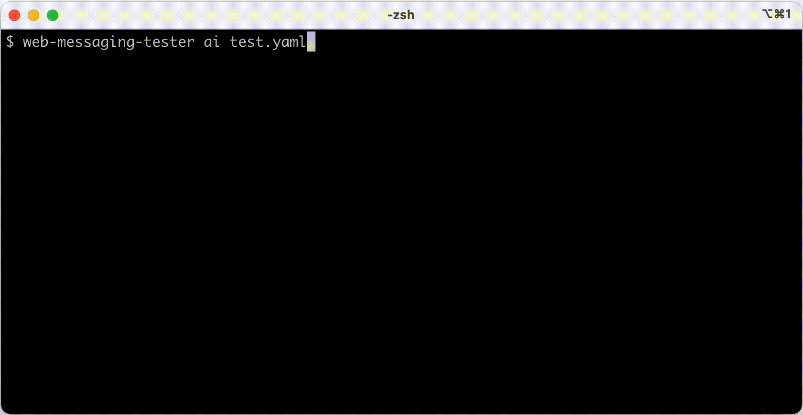

Let's create an automated test for our Genesys chatbot that leverages the latest in Generative AI!
In this article I thought it might be fun to demonstrate the new feature I created for an [open-source testing tool I
created](https://github.com/ovotech/genesys-web-messaging-tester), which I [recently posted about](https://www.linkedin.com/feed/update/urn:li:activity:7132394543659782146/). It's super simple to
use, so you could even follow along with your own chatbot.

Let's jump straight in and install the tool!

## Installing Web Messaging Tester


[Web Messaging Tester](https://github.com/ovotech/genesys-web-messaging-tester) is a command-line application you install on your machine. It's free, open-source, works on
Windows, Mac and Linux and is versatile enough to be integrated into [automated pipelines](https://makingchatbots.com/blog/automating-development-of-genesys-chatbots.html), as
well as run locally on your machine.

Although we'll be creating an AI-based test, you can also use it to write more conventional [dialogue based tests](https://github.com/ovotech/genesys-web-messaging-tester#testing-with-scripted-dialogues).

To install it just open the command-line and run:

```shell
npm install -g @ovotech/genesys-web-messaging-tester-cli
```

_If your computer complains that you don't have NPM or Node.js then you can download the installer at [nodejs.org](https://nodejs.org/)._

## Creating an API key for OpenAI


The testing tool leverages OpenAI's ChatGPT to realistically converse with your chatbots during the
tests. However, to be able to use OpenAI's API you will need an API key.

Getting an API key is as easy as:

1. [Going to OpenAI](https://openai.com/) and creating an account (if you don't already have one)
2. Following their [instructions for creating an API key](https://help.openai.com/en/articles/4936850-where-do-i-find-my-api-key)
3. Following their [guide to set your API Key](https://platform.openai.com/docs/quickstart/step-2-setup-your-api-key) on the same computer as the testing tool

_Whilst my tool is free, using OpenAI's API is not - although its pricing seems reasonable, and is usage based._

## Writing our automated AI test

Now the fun part, writing our test. A test is defined in a file (a YAML formatted file to be precise) and
contains 3 notable parts:

1. `deploymentId` - The ID of our Web Messenger Deployment that we want to test
2. `prompt` - The Prompt used to instruct ChatGPT how we want it to interact with our bot (more on this below)
3. `terminatingPhrases` - The phrases we want the testing tool to look out for that indicate whether the test passed or failed

We can see these 3 parts in the config file for our test:

```yaml
config:
  deploymentId: xxxxxxxx-xxxx-xxxx-xxxx-xxxxxxxxxxxx
  region: xxxx.pure.cloud
scenarios:
  "Chatbot recognises ISBN numbers":
    setup:
      prompt: |
        I want you to play the role of a customer talking to
        a company's online chatbot. You must not break from
        this role, and all of your responses must be based on
        how a customer would realistically talk to a company's
        chatbot.

        To help you play the role of a customer consider the
        following points when writing a response:
        * Respond to questions with as few words as possible
        * Answer with the exact word when given options

        As a customer you would like to get more information
        for a book, based on it's ISBN. Provide a real ISBN
        and if the title you are given for the book is correct
        then say 'PASS' else say 'FAIL' along with the reason
        why you failed. Never supply the same ISBN twice.

        If you have understood your role and the purpose of
        your conversation with the company's chatbot
        then say the word 'Hello' and nothing else.
      terminatingPhrases:
        pass: ["PASS"]
        fail: ["FAIL"]
```

### Instructing ChatGPT on what to test

The prompt section instructs ChatGPT of the role it will be playing when conversing with our chatbot, and
what we want it to achieve.

Getting the prompt just right for your tests can involve a bit of trial and error, but [there are plenty of guides to
help you](https://help.openai.com/en/articles/4936848-how-do-i-create-a-good-prompt). I'm also putting together a
[list of example prompts to get help people get started](https://genesys-messenger-tester.makingchatbots.com/writing-tests/ai/example-prompts.html), so be sure to send me
what you end up using.

### Deciding when a test passes or fails

The `terminatingPhrases` are what my tool is looking out for during the conversation. Depending on which one it sees in
the response from ChatGPT it will either pass or fail the test.

In the test above the prompt is instructing ChatGPT to use the words `PASS` or `FAIL`.

## Running the test

With the tool installed, OpenAI's key set and a test file defined we can now run the test! This is as easy as running
the command below and pointing it at the test file we defined above:

```shell
web-messaging-tester ai test.yaml
```



It's that simple! If you end up using this tool I'd love to hear how you got on, or what improvements you think
could be made to the tool.

Like what you read? Follow me on [LinkedIn](https://www.linkedin.com/in/lucas-woodward-the-dev/) to be notified of future articles.
